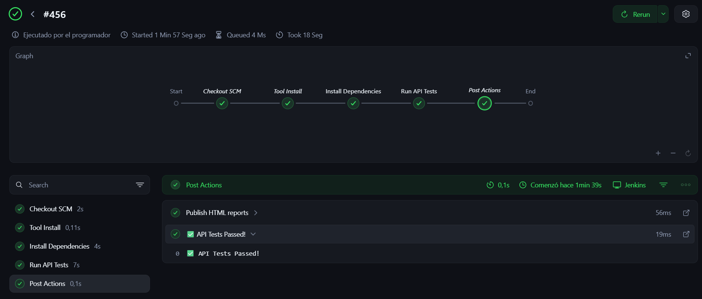
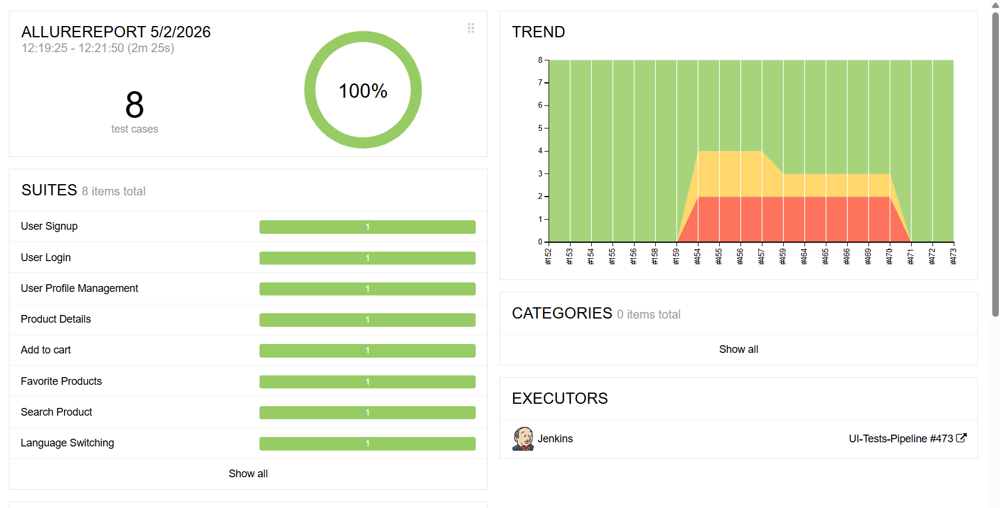
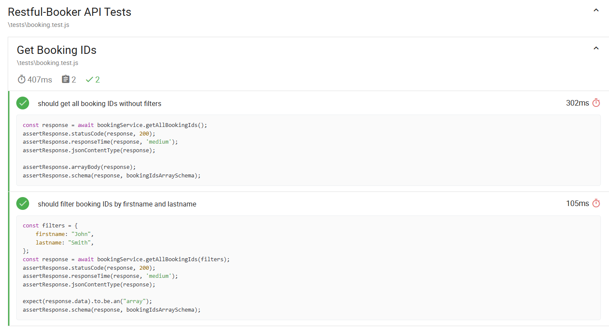

# wdio-cucumber-e2e-framework

   

A scalable end-to-end test automation framework built with **WebdriverIO**, **Cucumber (BDD)**, and **TypeScript**. Validates both UI and API layers of web applications with a focus on maintainability, reliability, and fast feedback.

---

## Table of Contents

- [Tech Stack](#tech-stack)
- [Architecture](#architecture)
- [Project Structure](#project-structure)
- [Getting Started](#getting-started)
- [Running Tests](#running-tests)
- [CI/CD Integration](#cicd-integration)
- [Reports](#reports)
- [Test Strategy](#test-strategy)
- [Known Limitations](#known-limitations)

---

## Tech Stack

| Layer | Tool |
|---|---|
| Test Framework | WebdriverIO |
| BDD | Cucumber (Gherkin) |
| Language | TypeScript |
| Assertions | Chai |
| Reporting | Allure, Mochawesome |
| CI/CD | Jenkins |
| Browsers | Chrome (Headless), Firefox (Headless) |

---

## Architecture

The framework follows a clean, layered architecture that separates test intent from implementation:

```
tests (features)
       ↓
step definitions
       ↓
page objects / services
       ↓
    UI / API
```

**Key design patterns:**

- **Page Object Model (POM)** — encapsulates UI selectors and interactions, keeping step definitions readable
- **Service Layer** — isolates API logic from test cases for independent backend validation
- **Data Layer** — centralized, typed test data factories reduce duplication and invalid inputs
- **Reusable Components** — shared helpers and UI elements across the suite

TypeScript is used throughout to catch errors at compile time, improve IDE support, and make refactoring safer.

---

## Project Structure

```
src/
 ├── business/
 │    ├── components/       # Reusable UI components
 │    ├── data/             # Test data factories
 │    └── pages/            # Page Object classes
 │
 ├── tests/
 │    ├── features/         # Gherkin feature files
 │    ├── step-definitions/ # Step implementations
 │    └── hooks.js          # Before/After hooks
 │
 ├── config/
 │    └── wdio.conf.js      # WebdriverIO configuration
 │
 └── core/
      ├── browser/          # Browser utilities
      └── logger/           # Logging helpers

api-tests/
 ├── services/              # API service abstractions
 ├── schemas/               # JSON schema definitions
 ├── tests/                 # API test specs
 └── config/                # API test configuration
```

---

## Getting Started

### Prerequisites

- Node.js >= 18.x
- npm >= 9.x

### Install dependencies

```bash
npm install
```

---

## Running Tests

### Run all UI tests

```bash
npm run wdio
```

### Run a specific feature

```bash
npx wdio run wdio.conf.js --spec ./src/features/login.feature
```

### Run by tag

```bash
# Smoke suite (~5 min)
npm run test:ui:smoke

# Authentication flows only
npm run test:ui:auth

# Product-related tests
npm run test:ui:products

# Exclude slow tests
npm run test:ui:not-slow
```

**Available tags:** `@smoke`, `@ui`, `@auth`, `@products`

### Run API tests

```bash
cd api-tests
npm install
npm run test:api
```

---

## CI/CD Integration


The framework integrates with **Jenkins** for continuous test execution.

- Triggered automatically on build events
- Supports targeted runs (smoke, regression) via parameterized builds
- Allure and Mochawesome reports published post-execution
- Enables early defect detection within the delivery pipeline

---

## Reports

### Allure (UI Tests)


Generate and open the HTML report after a test run:

```bash
npm run report
```

> Generated report files are excluded from version control.

### Mochawesome (API Tests)


```bash
cd api-tests
npm run test:api:report
```

Report output: `api-tests/reports/api-reports/api-test-report.html`

> API report files are excluded from version control.

---

## Test Strategy

### Scope

| Area | Coverage |
|---|---|
| Authentication | Login, signup flows |
| Product features | Search, favorites, product detail |
| UI behavior | Language switching |
| API | Booking workflow endpoints |

### Test Types

- **Smoke** — critical paths, fast feedback
- **Functional** — feature-level validation
- **Regression** — full suite
- **API** — backend validation, independent of UI

### Execution Configuration

```js
maxInstances: 2
maxInstancesPerCapability: 2
specFileRetries: 2
```

Parallel execution and retry support are configured for speed and stability. Cross-browser coverage includes Chrome and Firefox (both headless). Safari is excluded due to macOS-only WebDriver constraints.

### Stability Practices

- Explicit/implicit waits over hard-coded delays
- Stable, semantic selectors
- Test independence — no shared state between specs
- Retries as a fallback, not a substitute for root cause fixes

---

## Known Limitations

- Retry mechanism mitigates flaky tests but does not replace addressing root causes
- Negative and edge case coverage is limited in the current suite

### Planned Improvements

- Expand negative and boundary test scenarios
- Add screenshot and log capture to failure reports
- Improve test data management and isolation

---

## License

MIT


